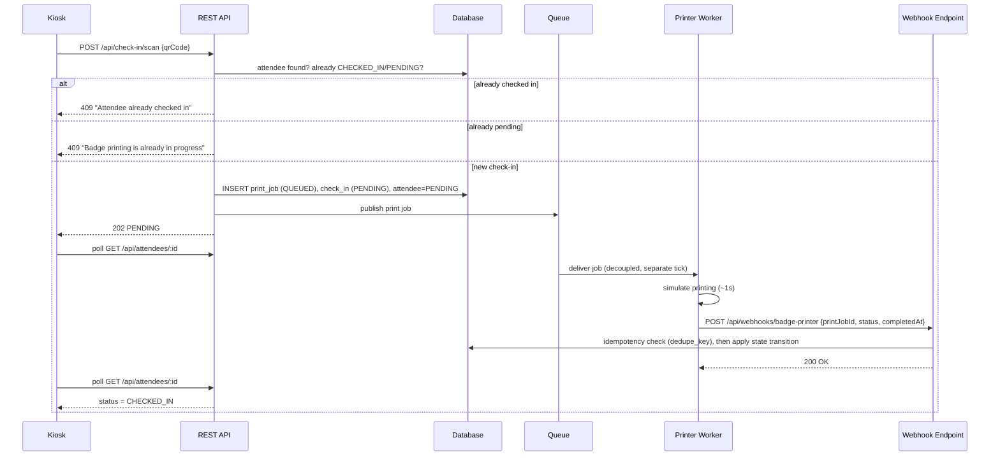

# Solstice Events Co. — Asynchronous Event Check-In & Badge Printing

A working MVP that migrates a conference check-in kiosk from a **synchronous**
badge-printer integration to an **asynchronous, queue + webhook** architecture.

---

## 1. Project overview

Staff scan an attendee's QR code at a kiosk. A badge must print before the
attendee is considered checked in. The vendor's synchronous "print and wait"
API is being deprecated, so the check-in flow now publishes a print job to a
queue, returns immediately with a **PENDING** state, and only transitions the
attendee to **CHECKED_IN** once a webhook confirms the badge actually printed.

## 2. Business problem

The kiosk used to call the badge-printer's REST API and block the HTTP
request until the physical printer finished. That coupled the UI's
responsiveness to printer hardware latency and made a single flaky printer
able to hang every kiosk in the building. The vendor is deprecating that
synchronous endpoint entirely, so the request/response model is no longer
available at all.

## 3. Old synchronous architecture

```
Kiosk → REST API → [BLOCKS] → Badge Printer → REST API → Kiosk shows "Checked In"
```

Problems: request timeouts under printer load, no retry story, no way to
know a job is "in progress" vs. "lost," and the whole flow dies if the
printer is briefly unreachable.

## 4. New asynchronous architecture

```
Kiosk → REST API → DB (PENDING) → Queue → Worker (simulated printer)
                                              ↓
                                      Webhook POST back to API
                                              ↓
                                    DB (CHECKED_IN) → Kiosk polls & updates
```

The HTTP request that starts a check-in returns in milliseconds with
`PENDING`. A separate consumer processes the print job on its own schedule.
The attendee is only marked `CHECKED_IN` when the webhook confirms success.

## 5. Architecture diagram



## 6. Technology stack

| Layer      | Choice |
|------------|--------|
| Frontend   | Vanilla HTML/CSS/JS (kiosk + admin dashboard, no build step) |
| Backend    | Node.js + Express |
| Database   | SQLite via Node's built-in `node:sqlite` (see rationale below) |
| Queue      | In-process async queue module (see rationale below) |
| Worker     | Simulated badge printer, runs in the same Node process, calls the webhook over real HTTP |
| Tests      | Node's built-in test runner (`node --test`) |

### Why SQLite instead of PostgreSQL?

The brief recommends PostgreSQL. For an MVP that must run with a single
`npm install && npm run dev` and no external services, this project uses
SQLite through Node 22's native `node:sqlite` module — no native compilation,
no Docker requirement, no connection string. All schema design (constraints,
foreign keys, unique indexes) uses standard SQL that maps directly onto
PostgreSQL. All database access is isolated behind `server/db.js`; migrating
to Postgres means swapping that one file for a `pg` client and keeping every
route and business rule identical.

### Why an in-process queue instead of Redis + BullMQ?

Same reasoning: BullMQ requires a running Redis server. `server/queue.js`
implements the same **publish / consume** contract BullMQ would (a producer
publishes a job and returns immediately; a separately-registered consumer
picks it up on its own event-loop tick, not synchronously inside the HTTP
request). This is a real decoupled queue, not a `setTimeout()` inside the
frontend — the queue module has no knowledge of the HTTP layer at all. Since
the demo has to run standalone locally, this trade-off keeps the diagram's
"real" async boundary while avoiding an infrastructure dependency. Swapping
in BullMQ is a matter of replacing `queue.js`'s implementation behind the
same `publish()` / `registerConsumer()` interface.

## 7. Database design

```
attendees        (id, name, email, qr_code UNIQUE, status, created_at, updated_at)
check_ins        (id, attendee_id FK, print_job_id, status, created_at, updated_at)
print_jobs       (id UNIQUE PK, attendee_id FK, status, simulate, created_at, updated_at, completed_at)
webhook_events   (id PK, print_job_id, attendee_id, status, completed_at, raw_payload,
                  dedupe_key UNIQUE, received_at, applied)
```

Key constraints enforced **at the database layer**, not just in application
code:

- `attendees.qr_code` — `UNIQUE`
- `print_jobs.id` — `PRIMARY KEY` (globally unique job IDs)
- **Partial unique index** `one_active_print_job_per_attendee` on
  `print_jobs(attendee_id) WHERE status IN ('QUEUED','PROCESSING')` — this is
  what makes it *impossible* for two active print jobs to exist for the same
  attendee, even under concurrent requests (see §9).
- `webhook_events.dedupe_key` — `UNIQUE`, the idempotency ledger for webhook
  callbacks.
- `CHECK` constraints on all `status` columns restrict rows to valid states.

## 8. Queue flow

1. `POST /api/check-in/scan` validates the attendee and current state.
2. Inside a single DB transaction, it inserts a `print_jobs` row (`QUEUED`),
   a `check_ins` row (`PENDING`), and flips `attendees.status` to `PENDING`.
3. `printQueue.publish(job)` is called — the job is pushed into an in-memory
   array and a `setImmediate` schedules draining **on a later tick**, so the
   HTTP response is not delayed by processing.
4. The response returns `202 PENDING` to the kiosk immediately.
5. The registered consumer (`server/worker.js`) picks up the job
   independently, "prints" for ~1s (or a configurable simulated delay),
   and calls the webhook over a real HTTP `fetch()` — exactly as an external
   vendor integration would.

## 9. Webhook flow & idempotency strategy

`POST /api/webhooks/badge-printer`:

1. **Authenticates** the caller via a shared-secret header
   (`X-Webhook-Signature`), rejecting mismatches with `401`.
2. **Validates** the payload shape (`printJobId`, `attendeeId`, `status`
   ∈ {SUCCESS, FAILED}), rejecting malformed bodies with `400`.
3. **Deduplicates** using a `dedupe_key = printJobId:status:completedAt`
   inserted into `webhook_events` under a `UNIQUE` constraint. If the insert
   collides, this exact event was already processed — the handler returns
   `200 DUPLICATE_IGNORED` **without mutating any other table**. This is the
   idempotency mechanism: retries and duplicate vendor callbacks are provably
   no-ops, verified by tests #6 and the concurrent-request test #10's
   sibling logic.
4. **Confirms job ownership**: `print_jobs.attendee_id` must match the
   payload's `attendeeId`, or the webhook is rejected with `400`.
5. **Terminal-state guard**: if the print job has already reached
   `SUCCESS`/`FAILED`, the callback is accepted (`200 ALREADY_TERMINAL`) but
   ignored for state purposes — it cannot re-open or corrupt an already
   resolved job.
6. Only if the job is still `QUEUED`/`PROCESSING` does the handler update
   `print_jobs.status` and — if the job still matches the attendee's current
   *pending* check-in — transition `attendees.status` from `PENDING` to
   `CHECKED_IN` or `FAILED`.

## 10. Duplicate scan protection

Enforced at **three layers**, so no single layer being buggy can create a
second badge:

1. **Application layer** — `POST /api/check-in/scan` checks the attendee's
   current status before doing anything. `CHECKED_IN` → `409` "Attendee
   already checked in." `PENDING` → `409` "Badge printing is already in
   progress," returning the existing job, never a new one.
2. **Database layer** — the partial unique index
   `one_active_print_job_per_attendee` makes it physically impossible to
   `INSERT` a second active `print_jobs` row for the same attendee. If two
   requests race past the application-layer check simultaneously, the second
   `INSERT` throws a `UNIQUE` constraint violation, which the handler catches
   and converts into the same `409` response.
3. **State machine** — `attendees.status` only transitions
   `REGISTERED/FAILED → PENDING → CHECKED_IN|FAILED`. There is no code path
   that re-enters `PENDING` from `CHECKED_IN`.

Test #10 fires five concurrent scan requests for the same attendee and
asserts exactly one succeeds and exactly one active print job exists in the
database afterward — proving the DB constraint, not just app logic, is doing
the work.

## 11. Out-of-order callback handling

Webhook callbacks are **not** assumed to arrive in the order jobs were
created, or even in the order a single job's own retries were sent. The
system stays correct because:

- Each webhook event is idempotency-checked *before* any state change
  (§9 step 3), so replays in any order are no-ops.
- Once a `print_jobs` row reaches a terminal state (`SUCCESS`/`FAILED`), any
  further callback for that same job ID — arriving early, late, or
  duplicated — is accepted and logged but never mutates state again
  (§9 step 5).
- The attendee is only transitioned if the incoming job ID still matches the
  attendee's **currently pending** check-in row. If a newer job has since
  superseded an older one (e.g., a retry after failure), a stale callback
  for the old job cannot overwrite the newer job's outcome, because the
  `check_ins` row it would need to match is no longer in `PENDING` status
  for that job ID.

Test #9 explicitly sends a later-timestamped `SUCCESS` callback first,
confirms the attendee reaches `CHECKED_IN`, then sends an earlier-timestamped
callback for the same job afterward and asserts it's ignored
(`ALREADY_TERMINAL`) with no state corruption. The demo UI also has a
`out_of_order` simulate mode.

## 12. Local setup

```bash
git clone <this project>
cd solstice-checkin
cp .env.example .env
npm install
npm run seed     # creates data/solstice.db and 3 test attendees
npm run dev       # starts the server on http://localhost:4000
```

Open `http://localhost:4000` in a browser.

### Docker (optional)

```bash
docker compose up --build
```

## 13. Environment variables

| Variable | Purpose | Default |
|---|---|---|
| `PORT` | HTTP port | `4000` |
| `WEBHOOK_SECRET` | Shared secret the worker signs webhook calls with | `dev-webhook-secret` |
| `WEBHOOK_URL` | Where the simulated printer worker posts callbacks | `http://localhost:4000/api/webhooks/badge-printer` |
| `DB_PATH` | SQLite file path | `./data/solstice.db` |

## 14. Running the application

```bash
npm run dev
```

## 15. Running tests

```bash
npm test
```

Runs 12 automated tests against a live server instance on an isolated test
database (`data/test.db`), covering every scenario in §20 of the brief:
successful check-in, unknown attendee, duplicate scan while `PENDING`,
duplicate scan after `CHECKED_IN`, successful webhook, duplicate webhook,
printer failure, invalid webhook (bad signature + malformed body),
out-of-order callbacks, database-level uniqueness under concurrency, and the
3-attendee scenario. All 12 currently pass.

## 16. Demo instructions

1. Open the **Kiosk** tab.
2. Click a test attendee button (Amina / Brian / David) to simulate a scan.
   The panel shows **PENDING** with an indeterminate progress bar.
3. Within ~1 second, the simulated printer worker calls the webhook and the
   UI (polling every 700ms) flips to **CHECKED_IN**.
4. Click the **same** attendee again — you'll get "Attendee already checked
   in," and the **Operations** tab's *Recent print jobs* list will show no
   new job was created.
5. Use the **Simulate outcome** dropdown before scanning to force:
   - `Printer failure` → attendee ends in `FAILED`, can be re-scanned to retry.
   - `Delayed webhook` → watch the PENDING state persist for ~4s.
   - `Duplicate webhook callback` → worker deliberately re-sends the same
     webhook; state stays correct (see Operations → Recent webhook events,
     the second one is marked ignored).
   - `Out-of-order callback` → included for the required scenario coverage;
     see §11 and test #9 for the guaranteed-deterministic version of this
     scenario (timing-based UI demos of true out-of-order delivery are
     inherently racy, so the strongest proof of this behavior is the
     automated test, not the UI toggle).
6. Switch to the **Operations** tab to see live totals, the attendee table,
   in-memory queue depth, recent print jobs, and recent webhook events.
   **Reset demo data** clears all check-ins/jobs back to `REGISTERED`.

## 17. Key engineering decisions

- All state transitions happen inside SQL transactions (`BEGIN
  IMMEDIATE` / `COMMIT` / `ROLLBACK`) so a crash mid-request can't leave a
  half-applied state.
- The queue and worker are separate modules with no HTTP-layer knowledge —
  they could be lifted into a separate process talking to Redis without
  touching `server/index.js`'s route logic.
- The worker calls the webhook over **real HTTP**, not a direct function
  call, to keep the simulation honest about the network boundary a real
  vendor integration would have.
- Every write path re-derives state from the database before responding, so
  the API never trusts client-supplied state.

## 18. Known limitations

- SQLite + in-process queue (see §6) stand in for PostgreSQL + Redis/BullMQ;
  swapping either requires only touching `server/db.js` or `server/queue.js`
  respectively, not the route/business logic.
- The in-process queue does not persist across a server restart (an
  in-flight job is lost if the process crashes mid-print). A production
  deployment on BullMQ/Redis would persist queued jobs across restarts.
- QR camera scanning is not implemented; the kiosk demo uses test-attendee
  buttons and a manual QR-code text field, both of which exercise the exact
  same `/api/check-in/scan` endpoint a camera scanner would call.
- Single shared-secret header for webhook auth, not per-vendor HMAC request
  signing — adequate for an MVP, noted as a production hardening item.
